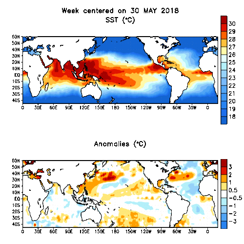
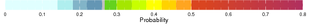

class: inverse, center, middle

```{r setup, include=FALSE}
options(htmltools.dir.version = FALSE)
dir.data <- '/mnt/discoDuro_externo/Respaldo/Respaldo_UMayor_Windows/francisco.zambrano/Documents/UMayor/Agronomia/Cursos/SAP_II-2018/Clases/Clima_1/data/'
library(tidyverse)
library(mapview)
library(sf)
climCL <- st_read(paste0(dir.data,'spatial/clima_chile2.gpkg'))
```

```{r xaringan-themer, include = FALSE}
library(xaringanthemer)
duo(primary_color = "#1F4257", secondary_color = "#F97B64")
```
# Normal climatológica

---

# ¿A qué corresponde la normal climatológica?

--

Ha servido para dos propositos:

1.- Entregan una `referencia` con la cual las condiciones `climáticas` pueden ser evaluadas.

2.- Son utilizados para propositos `predictivos` (implicitamente o explicitamente) como indicador de las condiciones esperadas.

--

>Tener una normal climatológica tiene ventajas y también desventajas

---

# Definiciones climáticas

`Promedios:` El promedio de valores mensuales de datos climatológicos sobre un periodo de tiempo específico.

`Promedio del periodo:` promedios de datos climatológicos calculados para un periodo de al menos diez años, empezando el 1 de enero de un año que termina con el número uno (ej: 1991)

`Normales:` Promedio del periodo calculado para un periodo uniforme de relativamente largo historial, al menos treinta años.

`Estandar climatológico normales:` El promedio de datos climatólogicos calculados para los siguientes periodos consecutivos de 30 años: 1 de enero 1901 al 31 diciembre 1930, 1 de enero 1931 al 31 de diciembre de 1960, etc

---
class: inverse, center, middle

#¿Cómo definimos el clima?

---

# Clasificación del clima

¿Por qué clasificarlo?

--

> La clasificación del clima ayuda a las personas a conocer las condiciones que una región experimenta durante el año. En véz de tener que describir todas las condiciones observadas en una región durante un mes o temporada del año, un esquéma de clasificación puede comunicar las condiciones esperadas utilizando solo dos o tres
términos.

--

¿Cómo lo podemos clasificar?

--

Existen varios esquemas de clasificación del clima.

Basados en:

- Precipitación y temperatura

- Precipitación y evapotranspiración

- Características ambientales

- ...
---

# Clasificación del clima

- El mapa más usado de clasificación del clima es el de `Wladimir Köppen`, presentado en su última versión en 1961 por `Rudolf Geiger`.

- Una gran cantidad de estudios y publicaciones posteriores adoptaron esta versión del mapa de `Köppen-Geiger`.

- El mapa de clima de `Köppen-Geiger` está disponible a una resolución espacial de 0.5 grados y representa el periodo de 50 años 1951-2000.

---
# Clasificación del clima

La clasificación del clima de `Köppen-Geiger` reconoce cinco mayores zonas climáticas, cada tipo es designado por una letra mayuscula. La `primera letra` corresponde al grupo:

A - Clima tropical humedo: todos los meses temperaturas sobre 18°C .

B - Clima seco: deficit de precipitación la mayoría del año .

C - Climas templado: húmedos de latitud media con inviernos suaves.

D - Climas continentales: húmedos de latitud media con inviernos fríos.

E - Climas polares: con inviernos y veranos extremadamente fríos.

La `segunda letra` está relacionada con el régimen de precipitaciones

La `tercera letra` está relacionada con la temperatura.

---
# ¿Cuál es el clima de Chile?

```{r, echo=FALSE,fig.width=10,message=FALSE}

mapview(climCL, zcol='climate')
```
---

# BWk y BSk (Árido o desértico)

Este tipo de clima cubre el 14% de la superfifice terrestre. Regiones con este clima tinen las siguientes características:

- baja humedad relativa y nubosidad

- baja frecuencia y cantidad de precipitación

- moderada a alta temperatura anual

- moderada a alta temperatura mensual.

---
# Bwk y Bsk (Árido o desértico)

.center[

]

---
# Cs (Mediterráneo)

El clima verano-seco de Latitudes medias se encuentra en los márgenes occidentales de los continentes entre 30 y 40° de latitud. Este clima a menudo se llama clima mediterráneo.

.center[

]

---

# Cf (Oceánico)

Clima humedo de latitudes medias. Se encuentra principalmente en el hemisferio Norte (60°-25°N) y en algunas partes del hemisferio Sur.

.center[

]

---

# ¿Cómo cambia el clima?


---
class: inverse, center, middle

# El Niño Oscilación Sur (ENSO) 

---

# ¿Qué es el ENSO

`ENSO` corresponde a la interacción entre atmósfera y océano en `Pácifico Tropical` que resulta en una variación periódica entre bajo-normal y sobre-normal de la `temperatura superficial del mar` y condiciones secas y húmedas durante el curso de algunos años.

Mientras que el océano tropical afecta la atmósfera sobre él, entonces también la atmósfera influencia el oceano por debajo. Una capa del océano Pacífico que es influenciada por el ENSO es la `termoclina`.

---

# ¿Cómo se mide el ENSO?

> Hay varias regiones en el Océano Pacífico tropical que han sido identificadas para el monitoreo y la identificación del desarrollo de El Niño o La Niña. Referenciado como regiones niño, las regiones más comunes están identificadas en la figura: 

.center[


]
---

# ¿Cómo se mide el ENSO?

1.- Niño 1+2 (0-10S, 80-90W). La región que tipicamente se calienta primero cuando se desarrolla un evento El Niño.

2.- Niño 3 (5S-5N; 150W-90W). La región que muestra la mayor variabilidad en temperaturas del mar durante eventos ENSO.

3.- Niño 3.4 (5S-5N; 170W-120W). La región que muestra una gran variabilidad durante eventos ENSO, y que está más cerca (que Niño) y que tiene mayor influencia sobre el cambio en el patrón espacial de la precipitación.

4.- Niño 4 (5S-5N: 160E-150W). La región donde cambios en la temperatura del mar llegan a valores que superan los 27.5C, que es un umbral importante para la producción de precipitación

---

# Fases del ENSO

--

1.- ENSO neutral

2.- El Niño: fase cálida

3.- La Niña: fáse fria

---

# ENSO neutral

.center[

]

Están condiciones son probables:

- Circulación atmosférica baja: hacia el Oeste

- Circulación de agua superficial: hacia el Oeste

- Circulación atmosférica superior: hacia el Este

- Termoclina: Inclinado hacia abajo desde el Pacífico oriental hasta el Pacífico occidental

---

# El Niño

.center[

]

Están condiciones son probables:

- Circulación atmosférica baja: hacia el Este y hacia el Oeste, pero más debil

- Circulación de agua superficial: hacia el Este

- Circulación atmosférica superior: hacia el Oeste

- Termoclina: Disminuye la pendiente, inclinado hacia abajo desde el Pacífico oriental hasta el Pacífico occidental

---

# La Niña

.center[

]

Están condiciones son probables:

- Circulación atmosférica baja: flujo mejorado Este hacia Oeste

- Circulación de agua superficial: flujo mejorado Este hacia el Oeste

- Circulación atmosférica superior: flujo hacia el Este mejorado

- Termoclina: Aumento de la pendiente, inclinado hacia abajo desde el Pacífico oriental hasta el Pacífico occidental

---

# Condición actual del ENSO

.center[

]
---

# Condición actual del ENSO

.center[

]

---
# Condición actual del ENSO

.center[

]


---

# Impacto del ENSO en Chile

Esperar condición humeda (JJA) cuando hay fase Niña

.center[
  

]
---

# Impacto del ENSO en Chile

Esperar condición humeda (JJA) cuando hay fase Niño

.center[
  

]

---

# Impacto del ENSO en Chile

Esperar condición seca (JJA) cuando hay fase Niña

.center[
  

]

---

# Impacto del ENSO en Chile

Esperar condición seca (JJA) cuando hay fase Niño

.center[
  

]
---
# Predicción del ENSO

Publicado el 20 de agosto 2018
.center[

]

---
# Resumen de las condiciones pronosticadas los últimos 22 meses

Modelos dinámicos

.center[

]

---
# Resumen de las condiciones pronosticadas los últimos 22 meses

Modelos estadísticos

.center[

]

---
# Resumen de las condiciones pronosticadas los últimos 22 meses

Todos los modelos 

.center[

]

---

# Fuentes de datos climáticos

Explorador climático $(CR)^2$

http://explorador.cr2.cl

http://agroclimatico.minagri.gob.cl/

http://www.climatedatalibrary.cl

Estaciones climatológicas

- Dirección Meteorológica de Chile `(DMC)`

- Dirección General de Aguas `(DGA)`

---

# Referencias

Kottek, M., J. Grieser, C. Beck, B. Rudolf, and F. Rubel, 2006: World Map of the Köppen-Geiger climate classification updated. Meteorol. Z., 15, 259-263. DOI: 10.1127/0941-2948/2006/0130.

Fick, S.E. and R.J. Hijmans, 2017. Worldclim 2: New 1-km spatial resolution climate surfaces for global land areas. International Journal of Climatology

Ahrens C.D. 2012. Meteorology today: an introduction to weather, climate, and the environment. Boston, MA:
Cengage Learning

---
